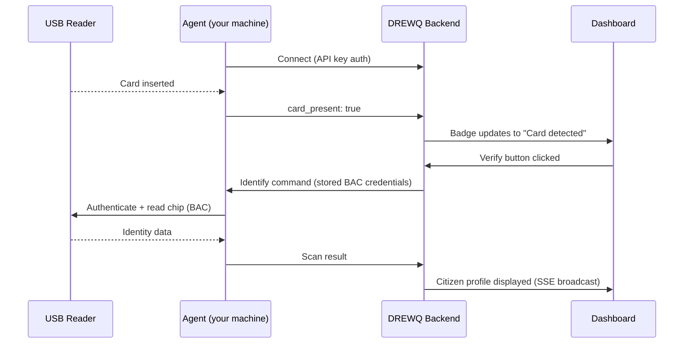

# DREWQ Reader Agent

The local agent that connects your USB smart card reader to your [DREWQ](https://drewq.com) dashboard.

It runs on the machine where the reader is physically plugged in, reads ECOWAS biometric identity cards, and relays scan results to the DREWQ backend over a secure connection.

---

## How it works



1. You plug in a supported USB smart card reader
2. The agent detects the reader automatically (no drivers needed on modern OS)
3. Card insertions and removals are detected in real time and pushed to the dashboard via SSE
4. When you press **Verify** on the verification page, the backend sends an identify command to the agent using stored BAC credentials
5. The agent authenticates with the card chip and reads the identity data
6. The backend stores the record and broadcasts the result to all connected dashboard tabs in real time

---

## Requirements

- **Python 3.11+**
- **macOS** (Ventura or later) or **Windows 10/11 (64-bit)**
- A [supported USB smart card reader](https://drewq.com/readers)
- A DREWQ API key (get one from your [dashboard](https://drewq.com))

### Smart card service

| Platform | Required |
|----------|----------|
| macOS    | Built-in — nothing to install |
| Windows  | Built-in Smart Card service — ensure it is running |

---

## Installation

```bash
# 1. Clone
git clone https://github.com/andrewakuaku/drewq-agent.git
cd drewq-agent

# 2. Install dependencies
pip install -r requirements.txt

# 3. Run
python main.py
```

A settings dialog will open on first launch. Enter your DREWQ API key and the agent will connect automatically.

---

## Configuration

Settings are stored at `~/.drewq/config.json`:

```json
{
  "api_key": "drewq_xxxxxxxxxxxxxxxxxxxxxxxxxxxx",
  "server_url": "https://api.drewq.com"
}
```

| Field | Description |
|-------|-------------|
| `api_key` | Your DREWQ API key — found in the dashboard under **API Keys** |
| `server_url` | URL of the DREWQ backend — defaults to the production server |

You can also open the settings dialog at any time from the system tray icon.

---

## System tray

Once running, the agent lives in the system tray (menu bar on macOS, taskbar on Windows):

| State | Icon |
|-------|------|
| Connected | Green circle |
| Scanning | Yellow circle |
| Disconnected / error | Red circle |

Click the tray icon to open the menu. Select **Settings…** to update your API key or server URL, or **Quit** to stop the agent.

### Settings dialog

On macOS the settings dialog displays the app icon. Enter your API key and server URL when prompted.

---

## Supported readers

Any USB smart card reader that supports the CCID protocol and ISO 7816 is compatible. The agent detects readers automatically — no configuration needed.

See the full list at [drewq.com/readers](https://drewq.com/readers).

---

## Updating

When a new version of the agent is released, pull the latest changes and restart:

```bash
cd drewq-agent
git pull origin main
pip install -r requirements.txt
python main.py
```

> **Tip:** Run `git pull` before launching the agent each time to stay on the latest version.

---

## Troubleshooting

**"No smart card readers found"**
- Make sure the reader is plugged in before launching the agent
- On Windows, check that the **Smart Card** service is running (`services.msc`)

**"Authentication failed. Check your API key in Settings"**
- Verify the API key in Settings matches the one in your DREWQ dashboard
- Make sure the key has not been revoked

**"Card read timed out"**
- Ensure the card is placed flat on the reader with the chip making contact
- Try removing and reinserting the card

**Agent shows connected but scans fail**
- Check the backend logs in your Heroku dashboard
- Ensure your API key has not been revoked

---

## License

MIT
